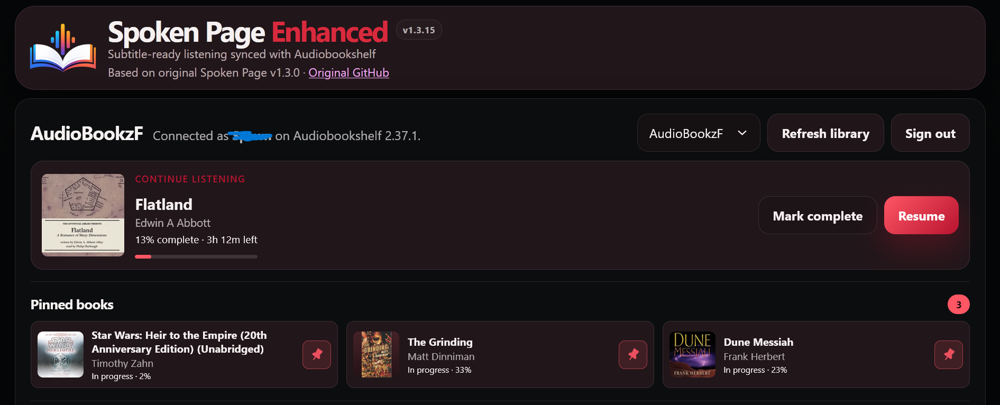
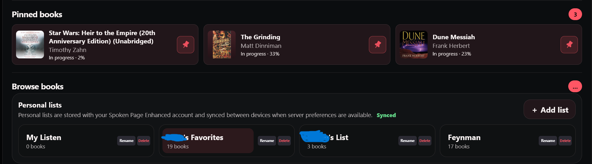
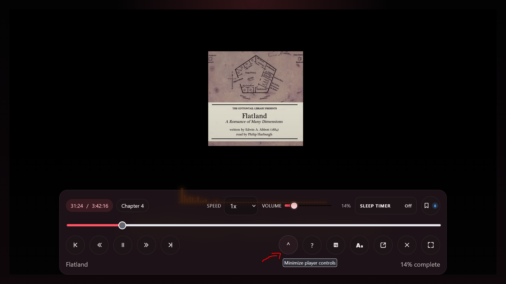
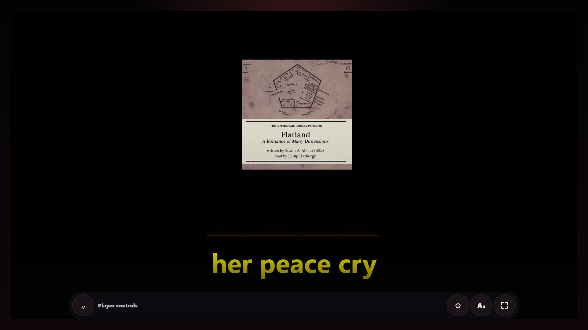
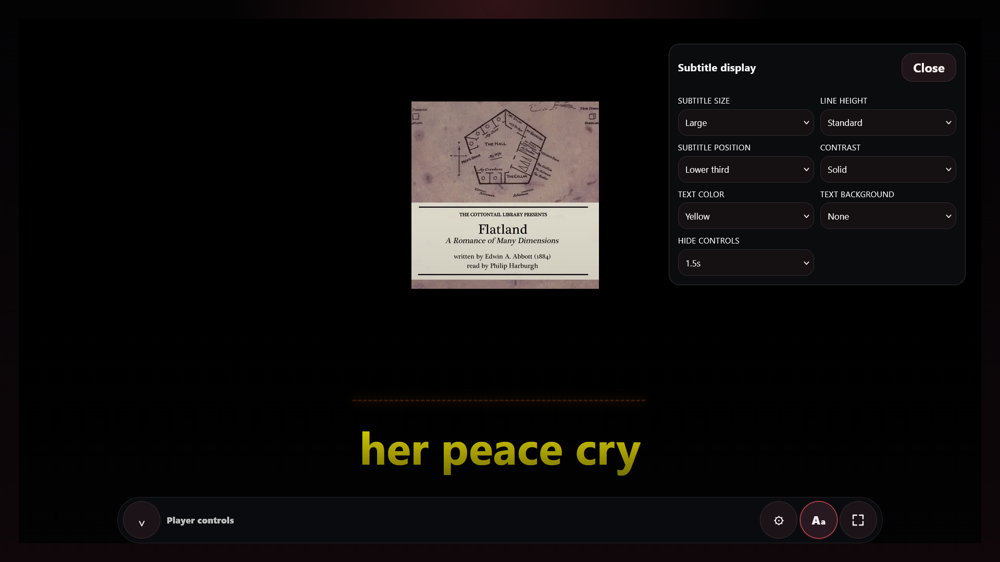
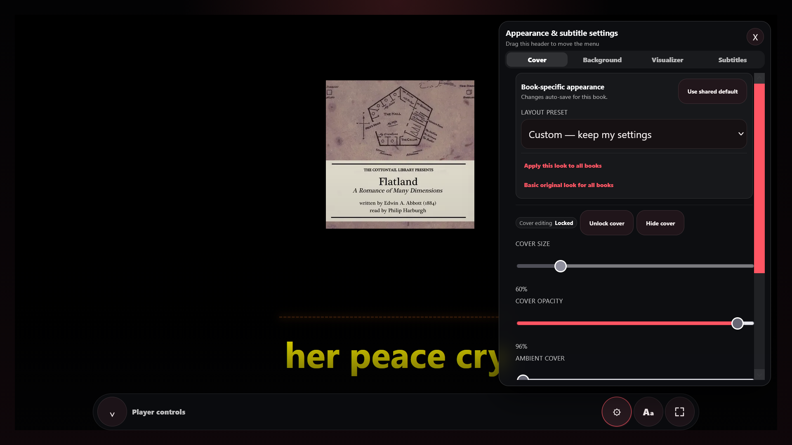

# Spoken Page Enhanced

**Subtitle-first listening for Audiobookshelf — with read-along playback, fullscreen customization, visualizer effects, bookmarks, and personal lists.**

> **Spoken Page Enhanced v1.3.2**  
> Based on **Spoken Page v1.3.0** by [JCDeSantis](https://github.com/JCDeSantis/spoken-page)

[Original Spoken Page](https://github.com/JCDeSantis/spoken-page) · [Audiobookshelf](https://www.audiobookshelf.org/)


## What is Spoken Page Enhanced?

Spoken Page Enhanced is an independent enhancement project built from Spoken Page v1.3.0. It keeps Audiobookshelf as the source of truth while adding a more customizable read-along experience for people who want to listen to an audiobook while following its text on screen.

This repository is **not the official Spoken Page repository**. Please use the original project for upstream features, issues, and releases. See the credit section below.


## Screenshots

### Library (Top Main)



### Book details / Lists



### Fullscreen player


###  Minimize/ Roll up/down Player Controls 



### Player Controls Minimized



### Subtitle Settings



### Cover/BG/Audio visualizer effects/Subtitle settings Menu



## Original Spoken Page features retained

Spoken Page v1.3 provides the foundation for this project. The upstream project includes a responsive subtitle-first Audiobookshelf web player, complete-library search, Audiobookshelf-derived listening status plus Want to listen, remembered library views, series handling, progress-save feedback, account-synced pinned books, resume/continue listening, multi-track progress synchronization, chapters/timeline navigation, playback speed and subtitle timing, sleep timer, focused/separate player views, keyboard/media-session controls, automatic SRT/VTT discovery, local subtitle upload, subtitle-focused reading, and per-book subtitle source/timing preferences.

See the original project's README and release notes for the authoritative upstream feature list and history:

https://github.com/JCDeSantis/spoken-page
Will need to install Docker

## Enhanced features

### Read-along / fullscreen player

- Subtitle-focused fullscreen listening view.
- Current audiobook cover used as the visual centerpiece.
- Cover art is proportional rather than stretched or cropped.
- Cover art can be resized, repositioned, and adjusted for opacity.
- Cover editing is locked by default and must be unlocked before editing.
- Per-book visual settings can be saved.
- Fullscreen close, fullscreen, pop-out, subtitle options, and appearance controls are kept separate from the visual layers so transparent artwork cannot block buttons.
- Minimize up/down Player Controls to see entire screen while adjusting or convenience.

### Appearance customization

- Solid fullscreen background colors.
- Dark, gray, bright, and colored background choices.
- Optional background patterns.
- Optional ambient/blurred cover background.
- Appearance controls are grouped into a dedicated menu instead of cluttering the transport row.
- Layout controls are designed to allow the visual layer, cover, and subtitles to be arranged independently.

### Audio visualizer

- Optional audio-reactive visual layer.
- Bars, waveform, combined wave/bars, and pulse-style modes where supported by the current build.
- Position, size, opacity, color, glow, sensitivity, and smoothing controls.
- Editing can be locked so playback does not accidentally move the visual.
- Visualizer is intended to sit behind/around the read-along presentation without obscuring subtitles or transport controls.

### Bookmarks

- `B` keyboard shortcut for bookmarks.
- Timeline bookmark markers.
- Jump to bookmark.
- Remove individual bookmarks.
- Clear bookmark list.

### Personal lists

- Personal listening lists in addition to Audiobookshelf's normal library/status system.
- Rename lists.
- Add/remove books from lists.
- Delete lists with confirmation.
- Account preference synchronization when supported by the Spoken Page preference backend.
- Browser-local fallback for temporary/offline situations.

### SRT-aware library workflow

- **Has SRT subtitles** library filter.
- Detects attached subtitle files through Audiobookshelf item metadata.
- Subtitle selection and timing preferences can be saved independently per book.

## AI-assisted development notice

This project was developed with substantial **AI-assisted coding, debugging, refactoring, and documentation help**. The maintainer makes the final decisions and tests changes, but AI assistance does not guarantee that the software is bug-free or suitable for every deployment.

Review changes before using the project in an important or internet-facing environment, keep backups, and report problems through GitHub Issues.

## Installation

Spoken Page Enhanced can be installed either as a new application or as an enhancement to an existing compatible Spoken Page v1.3.0 source installation.

### New installation — recommended

For a new installation, use the **Spoken Page Enhanced** repository/release directly.

You do **not** need to install the original Spoken Page separately.

See the complete [Installation Guide](INSTALL.md) for Docker Desktop setup, Audiobookshelf configuration, first startup, and troubleshooting.

### Requirements

Spoken Page Enhanced runs with Docker.

**Windows:** Install [Docker Desktop for Windows](https://docs.docker.com/desktop/setup/install/windows-install/) and make sure Docker Desktop is running before starting the application.

Verify Docker from PowerShell:

```powershell
docker --version
docker compose version
```

Node.js and npm are **not required on the host computer** for the normal Docker installation.

### Quick start

Clone the repository:

```powershell
git clone https://github.com/matrixblad77/Spoken-Page-Enhanced.git
cd Spoken-Page-Enhanced
```

Create your environment file:

```powershell
Copy-Item .\.env.example .\.env
```

Configure `.env` with a strong secret and the Audiobookshelf URL reachable from inside the Docker container.

Example:

```dotenv
SPOKEN_PAGE_SECRET=replace-with-a-long-random-value
SPOKEN_PAGE_ABS_BASE_URL=http://host.docker.internal:13378
```

Start the application:

```powershell
docker compose up -d
```

Then open:

```text
http://localhost:3000
```

For the complete setup instructions, see [INSTALL.md](INSTALL.md).

### Already using Spoken Page v1.3.0?

Spoken Page Enhanced v1.3.2 is based on **Spoken Page v1.3.0**.

If you already have a working Spoken Page v1.3.0 source installation, you can apply the Enhanced v1.3.2 changes without replacing your machine-specific configuration.

The primary Enhanced source files for v1.3.2 are:

```text
src/components/player-panel.tsx
src/components/dashboard.tsx
src/components/spoken-page-header.tsx
src/app/globals.css
```

**Do not overwrite your `.env`, `compose.yml`, Audiobookshelf authentication/connection settings, persistent data, or other machine-specific configuration unless the release-specific instructions tell you to do so.**

Back up your existing project before applying changes and follow [INSTALL.md](INSTALL.md) for the existing-installation procedure.

### Version compatibility

| Enhanced release | Upstream Spoken Page base |
| ---------------- | ------------------------- |
| v1.3.2           | v1.3.0                    |

Enhanced releases are tied to their documented upstream base version. Do not copy files from an Enhanced release into an unrelated Spoken Page version without checking the release documentation first.


Depending on the release, additional Enhanced source files may be included. Follow the release-specific installation guide rather than copying unknown files into an unrelated Spoken Page version.

### Docker build from an existing compatible project

From the Spoken Page project directory:

```powershell
docker compose up -d --build
```

Then verify:

```powershell
docker compose ps
```

Refresh the browser with `Ctrl+F5` after rebuilding.

### Important configuration rule

Keep your own:

```text
.env
compose.yml / docker-compose.yml
Audiobookshelf connection/authentication changes
persistent data / Docker volumes
```

Never commit private `.env` files, tokens, passwords, logs, local library paths, personal screenshots, or machine-specific configuration.

## Creating a new GitHub repository

Suggested repository name:

```text
spoken-page-enhanced
```

Suggested description:

```text
Spoken Page Enhanced — a subtitle-first Audiobookshelf companion with fullscreen read-along customization, visualizer effects, bookmarks, and personal lists.
```

Suggested topics:

```text
audiobookshelf
audiobook
subtitles
srt
read-along
docker
nextjs
pwa
audiobook-player
audiobook-library
```

## Credit and thanks

A huge thank-you to **JCDeSantis** for creating the original Spoken Page project and for making it open source. Spoken Page provides the core Audiobookshelf integration, playback, progress synchronization, subtitle handling, account/session model, and overall application foundation that this project builds on.

Original project:

https://github.com/JCDeSantis/spoken-page

The upstream repository currently identifies the project as MIT licensed. Keep the upstream license/attribution requirements with the code when redistributing derivative work.

## Privacy and security

- Do not commit `.env` files or secrets.
- Do not commit Audiobookshelf tokens or cookies.
- Do not commit logs containing private library paths.
- Do not publish screenshots that expose private usernames, IP addresses, folder paths, or personal media metadata.
- For internet-facing deployments, use HTTPS and review the security guidance from the upstream Spoken Page project.

## Contributing

Bug reports, screenshots, UI ideas, and pull requests are welcome.

Before opening an issue:

1. State your Spoken Page Enhanced version.
2. State the original Spoken Page version it is based on.
3. State Windows/browser/Docker versions when relevant.
4. Include the exact error message.
5. Remove personal paths, usernames, IP addresses, tokens, and private media names from logs and screenshots.

## Versioning

Enhanced versions use their own version number. They are separate from the upstream Spoken Page version.

Example:

```text
Upstream base: Spoken Page v1.3.0
Enhanced release: v1.3.2
```

Future Enhanced releases can use `v1.3.3`, `v1.4.0`, etc. Record meaningful changes in `CHANGELOG.md`.

## License

This project is based on the MIT-licensed Spoken Page project. Preserve the upstream license and attribution notices for the original portions of the code. See `LICENSE` in the repository and the original project for the authoritative licensing text.
